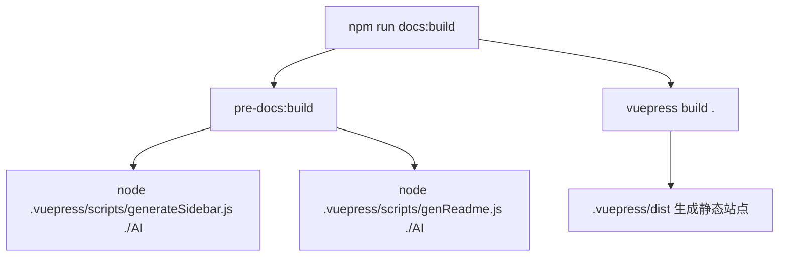
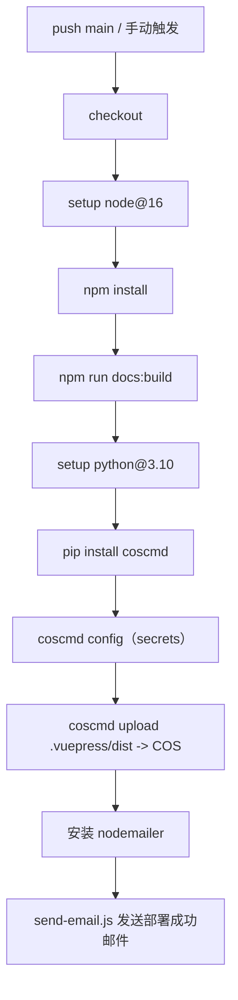
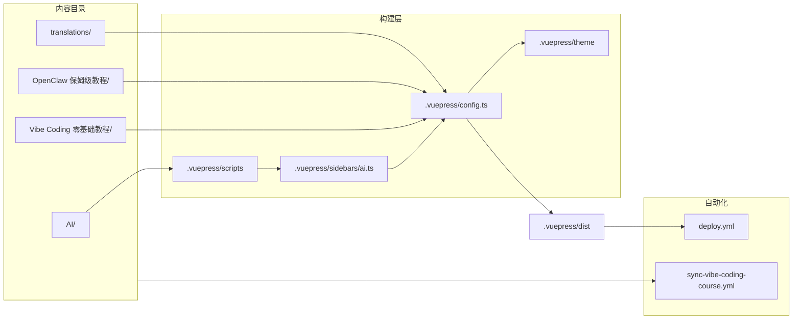

# 02 整体架构

## 运行时架构（访问者视角）

该项目最终被构建为静态站点：

- 浏览器访问静态资源（HTML/CSS/JS/图片）
- 客户端侧由 VuePress（Vue）完成页面渲染与导航交互
- 不包含后端运行时（除非外部系统为站点提供 CDN/对象存储托管）

## 构建时架构（维护者视角）

构建链路由 npm scripts 串联，核心由三段组成：

1. **索引生成（构建前）**：扫描 `AI/` 内容树，生成侧边栏数据与目录 README
2. **VuePress 构建**：将 Markdown 编译为静态站点
3. **部署/同步（CI）**：将构建产物发布到对象存储，并按需通知或同步变更

### 构建主链路（本地/CI 通用）

入口脚本见 [`package.json`](../../package.json)。

### 部署链路（GitHub Actions）

部署工作流见 [`deploy.yml`](../../.github/workflows/deploy.yml)：

### 同步链路（变更文件列表 -> 后端）

同步工作流见 [`sync-vibe-coding-course.yml`](../../.github/workflows/sync-vibe-coding-course.yml)：

- 用 `git diff` 计算 A/M/D 三类文件列表
- 用 `jq` 构造 JSON payload
- 用 `curl` 携带 Bearer token POST 到后端

## 模块划分（代码侧）

| 模块 | 位置 | 职责 |
|---|---|---|
| 站点配置 | `.vuepress/*.ts` | title/SEO/head、插件、导航/侧边栏、主题配置 |
| 主题覆盖 | `.vuepress/theme/**` | 覆盖默认主题组件（Layout/Footer/ExtraSidebar 等） |
| 内容索引脚本 | `.vuepress/scripts/**` | 自动生成侧边栏与目录 README、统计/格式化等 |
| CI/CD | `.github/workflows/**` | 构建部署、同步变更 |

## 关键依赖关系（工程视角）

